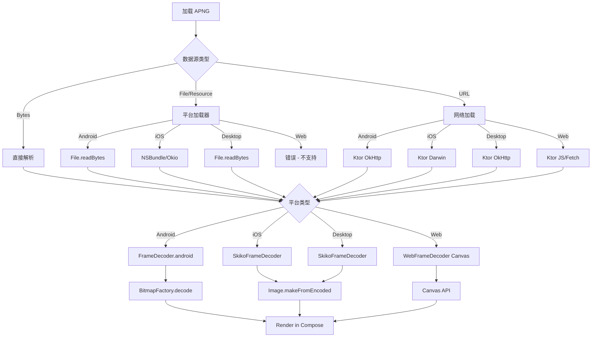

## 用户需求概述

本项目是一个 Kotlin Multiplatform APNG（Animated PNG）解析和渲染库，目前支持 Android 和 Desktop（JVM）平台完整实现，但 iOS 和 Web 平台的实现不完整。用户需要完善 iOS 和 Web 平台的支持，使库在全平台可用。

## 核心缺失功能

### iOS 平台缺失实现

1. **FrameDecoder 完整实现**：需要集成 Kotlin/Native 与 UIImage，实现帧解码（当前仅占位符）
2. **ApngState 文件加载**：需要实现从 iOS 文件系统加载 APNG 文件（当前仅占位符）
3. **网络加载支持**：Ktor Darwin 客户端已配置，但需确保网络功能完整

### Web 平台缺失实现

1. **FrameDecoder 完整实现**：需要集成 Canvas 2D/WebGL 进行帧解码（当前仅占位符）
2. **文件加载支持**：Web 平台无法访问本地文件，需要正确处理（当前不支持）
3. **网络加载支持**：Ktor JS 客户端已配置，需实现完整的 Fetch API 集成

## 产品特性需求

- iOS 平台可以从本地文件、网络 URL、Compose Resources 加载 APNG 文件并渲染
- Web 平台可以从网络 URL 加载 APNG 文件并在 Canvas 上渲染
- 完善的错误处理和用户友好的提示信息
- 与现有 Android/Desktop 实现保持 API 一致性
- 跨平台缓存策略统一应用

## 设计目标

- 遵循 Compottie 项目的架构最佳实践
- 利用 Okio 统一 I/O 操作
- 通过 Ktor HTTP 客户端实现跨平台网络加载
- 使用 expect/actual 机制处理平台差异
- 保持代码模块化，便于测试和维护

## 技术栈选择

- **Kotlin Multiplatform**: 核心开发语言，利用 expect/actual 处理平台特异性
- **Okio**: 跨平台二进制 I/O 操作，已集成
- **Ktor Client**: 跨平台 HTTP 客户端
- iOS: Darwin 引擎（NSURLSession）
- Web: JS 引擎（Fetch API）
- **平台特定库**:
- iOS: UIKit (UIImage), Foundation (NSBundle, FileSystem)
- Web: HTML5 Canvas 2D/WebGL (通过 JS interop)
- Android: BitmapFactory（已完成）
- Desktop: Skiko (org.jetbrains.skia.Image)

## 实现方案

### 1. iOS FrameDecoder 实现（apng-core/src/iosMain）

**策略**：iOS 与 Desktop 共享 Skiko 图像渲染库

- 利用 iosMain 已依赖 skikoMain 的特性
- iosMain 复用 SkikoFrameDecoder（Image.makeFromEncoded）
- Skiko 在 iOS 上通过 Kotlin/Native 集成 Objective-C runtime

**关键点**：

- FrameDecoder.ios.kt 应为空占位符或重定向，因为 iosMain 依赖 skikoMain
- 验证 Skiko 在 iOS 平台上的图像解码能力

### 2. iOS ApngState 文件加载（apng-compose/src/iosMain）

**策略**：使用 Okio 和 NSBundle 进行文件系统访问

- 实现 `loadFileData(path: String): ByteArray` 
- 从 NSBundle 加载资源文件（Compose Resources）
- 从文件系统加载本地文件

**关键点**：

- 使用 Foundation API 获取应用 bundle 和 cache 目录
- 正确处理文件路径和资源名称解析
- 错误处理：文件不存在、权限问题等

### 3. Web FrameDecoder 完整实现（apng-core/src/webMain）

**策略**：利用 HTML5 Canvas API 进行帧解码

- 通过 JS interop 调用 Canvas 2D context
- 使用 createImageBitmap（如果可用）或 Canvas.drawImage
- 将解码结果作为 ImageData 对象返回

**关键点**：

- 实现 JS interop 封装（创建 Canvas、获取 ImageData）
- 内存中缓存帧数据
- 正确释放 Canvas 资源

### 4. Web 资源加载（apng-network-core/src/webMain）

**当前状态**：WebApngResourceLoader 已正确实现限制

- ApngSource.File 和 Resource 被禁用（符合 Web 安全限制）
- 只支持 Bytes 和 Url 源
- 已配置 FakeFileSystem 用于内存缓存

**验证点**：确保网络加载通过 ApngSource.Url 正常工作

### 5. iOS 网络模块（apng-network）

**当前状态**：

- Ktor Darwin 客户端已配置
- KtorHttpClient.ios.kt 使用 Darwin 引擎
- ApngResourceLoader.ios.kt 支持文件和资源加载

**验证点**：

- HTTP 下载功能可用
- 缓存策略应用到 iOS（使用 Okio FileSystem.SYSTEM）

### 6. Web 网络模块（apng-network）

**当前状态**：

- Ktor JS 客户端已配置
- KtorHttpClient.web.kt 使用自动检测引擎
- HTTP 超时配置已就位

**需要完成**：

- 测试 Fetch API 集成
- 验证内存缓存正常工作

## 架构设计

### 系统流程

### 模块依赖关系

- **apng-core**: 核心 PNG/APNG 解析，包含平台特定的 FrameDecoder
- commonMain: 解析逻辑
- androidMain: AndroidFrameDecoder (BitmapFactory)
- skikoMain: SkikoFrameDecoder (Skiko Image)
- iosMain: 依赖 skikoMain，使用 SkikoFrameDecoder
- webMain: WebFrameDecoder (Canvas API)

- **apng-network-core**: 资源加载抽象和缓存策略
- commonMain: 接口定义
- iosMain: iOS 特定文件系统访问
- webMain: Web 限制处理

- **apng-network**: 网络实现
- commonMain: KtorHttpClient 核心逻辑
- iosMain: Darwin HTTP 客户端配置
- webMain: JS HTTP 客户端配置

- **apng-compose**: UI 组件和状态管理
- commonMain: Composable 定义
- androidMain: 文件加载实现
- desktopMain: 文件加载实现
- iosMain: iOS 文件加载实现
- wasmJsMain: Web 限制处理

## 实现分阶段方案

### 阶段 1：Web FrameDecoder 实现

- 创建 Canvas 2D interop 封装
- 实现 WebFrameDecoder 的实际解码逻辑
- 验证 createImageBitmap 兼容性处理

### 阶段 2：iOS 平台完成

- 确认 SkikoFrameDecoder 在 iOS 上可用
- 实现 ApngState.ios.kt 文件加载
- 测试 Ktor Darwin 网络功能

### 阶段 3：集成测试

- 验证各平台端到端功能
- 测试多种数据源（字节、文件、URL）
- 测试缓存机制

### 阶段 4：演示应用完善

- 添加网络加载演示
- 添加进度显示
- 添加错误处理展示

## 性能考虑

- **FrameDecoder 缓存**: 每个平台实现都包含本地缓存，避免重复解码
- **Web 内存管理**: Canvas 资源应及时释放，避免内存泄漏
- **iOS 文件 I/O**: 使用 Okio 进行高效的文件读取
- **网络缓存**: LRU 磁盘缓存（iOS/Desktop）和内存缓存（Web）

## 编码标准

- 遵循现有代码风格和命名规范
- 完善异常处理和错误提示
- 添加平台特定的性能注释
- 测试代码覆盖新增逻辑