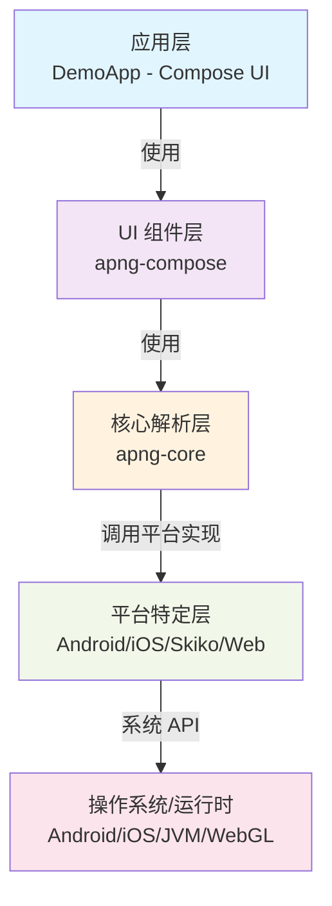

## 产品概述

一个 Kotlin Multiplatform APNG（Animated PNG）解析和渲染库，支持 Android、iOS、Desktop（JVM）、Web（Wasm/JS）四个平台。库采用模块化架构，参考 compottie 开源库的设计理念，提供核心 APNG 解析能力和跨平台渲染支持。

## 核心功能

1. **APNG 格式解析**

- PNG 格式解析（PNG 文件签名、标准 chunks 处理）
- APNG 扩展解析（acTL、fcTL、fdAT chunks）
- 帧数据提取、解码和管理
- 动画元数据提取（帧数、延迟时间等）

2. **跨平台渲染支持**

- Android：基于 Android Bitmap API 的解码和渲染
- iOS：基于 iOS Image API 的解码和渲染
- Desktop（JVM）：基于 Skiko 的图形渲染
- Web（Wasm/JS）：基于 Canvas/WebGL 的渲染

3. **Compose UI 集成**

- 跨平台 APNG Composable 组件
- 动画控制能力（播放、暂停、速度调整、循环）
- 生命周期管理和资源释放

4. **文件加载**

- 本地文件加载（支持四个平台）
- 网络文件加载能力
- 内存流加载支持

5. **示例应用**

- 演示应用展示 APNG 渲染效果
- 支持本地和网络 APNG 文件加载
- 提供播放控制界面

## 技术栈选择

### 多平台技术栈

- **Kotlin 版本**：2.3.0（已定版）
- **Compose Multiplatform**：1.10.0（已定版）
- **构建工具**：Gradle 8.11.2 + Kotlin Gradle Plugin
- **Android**：AGP 8.11.2，目标 SDK 36，最小 SDK 24
- **iOS**：Xcode Framework，支持 Arm64 和 Simulator Arm64
- **Desktop**：JVM 11，通过 Compose Desktop
- **Web**：Kotlin/Wasm JS 和 Kotlin/JS（二选一或兼容）

### 关键跨平台依赖

- **Okio**：跨平台二进制 I/O 和文件操作
- **Kotlinx Serialization**：跨平台数据序列化
- **Coroutines**：跨平台异步操作和线程管理
- **Skiko**：Desktop 和 iOS Native 渲染（通过 Skiko JVM 和 Native 模块）

### 项目模块结构

参考 compottie 的分层架构，设计如下模块：

```
apng/
├── apng-core/              # 核心 APNG 解析库（通用代码）
│   └── src/
│       ├── commonMain/     # 通用代码：PNG/APNG 解析、帧管理、动画控制
│       ├── androidMain/    # Android 特定：Bitmap 解码
│       ├── iosMain/        # iOS 特定：Image 解码
│       ├── skikoMain/      # Skiko 渲染（Desktop + iOS Native）
│       ├── webMain/        # Web 特定：Canvas/WebGL
│       └── commonTest/     # 通用单元测试
├── apng-compose/           # Compose UI 组件库
│   └── src/
│       ├── commonMain/     # 跨平台 Composable 组件
│       ├── androidMain/
│       ├── iosMain/
│       ├── jvmMain/
│       ├── wasmJsMain/
│       └── commonTest/
├── composeApp/             # 演示应用（现有）
│   └── 修改以依赖 apng-core 和 apng-compose
└── iosApp/                 # iOS 原生应用入口（现有）
```

## 技术架构设计

### 系统架构

采用**分层架构**：



### 数据流

1. **文件加载** → 2. **PNG/APNG 解析** → 3. **帧数据提取** → 4. **平台渲染** → 5. **Compose 显示** → 6. **动画控制**

### 核心模块划分

#### apng-core 模块职责

- **PNG 格式解析**：读取 PNG 签名、chunks（IHDR、PLTE、IDAT、IEND 等）
- **APNG 扩展支持**：解析 acTL（动画控制）、fcTL（帧控制）、fdAT（帧数据）chunks
- **帧管理**：提供帧索引、帧延迟、融合操作等元数据
- **图像解码**：通用图像解码逻辑（可由平台实现接管）
- **文件加载**：支持本地文件和网络流加载

#### apng-compose 模块职责

- **ApngImage Composable**：跨平台 APNG 显示组件
- **动画控制**：播放/暂停/速度/循环等控制
- **生命周期管理**：组件出入时的资源申请和释放
- **状态管理**：记录播放进度、当前帧等

#### 平台实现职责

- **Android**：Android Bitmap 解码、图像缓存
- **iOS**：iOS UIImage 解码、Metal 渲染
- **Desktop**：Skiko Canvas 渲染、内存管理
- **Web**：HTML5 Canvas/WebGL、性能优化

## 实现方法

### PNG/APNG 解析策略

**共通解析**（commonMain）：

- PNG 签名验证（`89 50 4E 47 0D 0A 1A 0A`）
- Chunk 读取和 CRC 校验（使用 Okio）
- APNG 特定 chunk 解析（acTL 获取帧数，fcTL 获取帧参数）
- 帧顺序管理

**平台特定解码**：

- Android：使用 `android.graphics.BitmapFactory` 逐帧解码
- iOS：使用 `UIImage` 和 `CGImage` API
- Desktop：使用 Skiko 内置的图像解码
- Web：使用 JavaScript 的 Canvas 图像操作

### 关键设计决策

1. **Okio 用于二进制 I/O**：跨平台、高效的字节流操作，避免平台差异
2. **Expect/Actual 模式**：解决平台间 API 差异（如 Image 对象）
3. **Skiko for Desktop**：统一 Desktop 和 iOS Native 的图形渲染
4. **协程驱动的异步加载**：支持网络加载和后台解码，不阻塞主线程
5. **帧缓存策略**：可配置的内存缓存，支持 LRU 清理机制
6. **模块间依赖单向**：apng-core 独立无依赖，apng-compose 依赖 core，app 层依赖两者

## 性能和可靠性

### 关键性能指标

- **解析开销**：PNG/APNG 文件头解析 < 10ms，支持大型 APNG（100+ 帧）
- **内存占用**：帧缓存采用 LRU 策略，单帧占用 = 像素宽 × 高 × 4 字节（RGBA）
- **渲染帧率**：目标 60 FPS（Desktop/Web）、30 FPS（移动端）

### 优化策略

1. **流式解析**：避免一次性加载整个文件到内存
2. **帧缓存**：只缓存播放过程中的关键帧，其他帧延迟加载
3. **平台原生解码**：委托给平台原生 API，避免重复实现
4. **异步加载**：网络和磁盘 I/O 使用 Coroutines 后台处理

### 错误处理和兼容性

- 完善的异常层次（PNG 格式错误、APNG 不完整、平台解码失败等）
- Fallback 机制：APNG 解析失败时降级为静态 PNG 显示
- 平台能力检测：Web 平台检测 WebGL 支持，降级到 Canvas

## 依赖管理

### 新增依赖（在 libs.versions.toml 中补充）

```
[versions]
okio = "3.9.0"
kotlinx-serialization = "1.7.0"
kotlinx-coroutines = "1.10.2"  # 已有
skiko = "0.7.100"  # 仅 Desktop/iOS 需要

[libraries]
okio = { module = "com.squareup.okio:okio", version.ref = "okio" }
kotlinx-serialization-core = { module = "org.jetbrains.kotlinx:kotlinx-serialization-core", version.ref = "kotlinx-serialization" }
skiko = { module = "org.jetbrains.skiko:skiko", version.ref = "skiko" }

[plugins]
kotlinx-serialization = { id = "org.jetbrains.kotlin.plugin.serialization", version.ref = "kotlin" }
```

### Gradle 配置

- 在 `build.gradle.kts` 中配置 KMP 多平台目标
- 使用 `sourceSets` 分离平台代码
- 正确配置各平台编译选项（iOS Framework、JVM 版本等）

## 实现执行顺序

1. 创建 apng-core 和 apng-compose 模块的 Gradle 配置
2. 实现通用 PNG/APNG 解析逻辑（commonMain）
3. 实现平台特定的图像解码（androidMain/iosMain/skikoMain/webMain）
4. 实现 Compose UI 组件和动画控制
5. 集成到 composeApp 演示应用
6. 编写单元测试和集成测试
7. 验证四个平台的功能完整性和性能