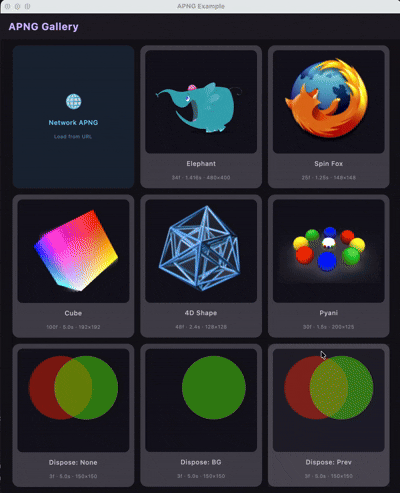

# APNG Kotlin Multiplatform

[English Version](./README.md)

[](https://kotlinlang.org)
[](https://www.jetbrains.com/lp/compose-multiplatform/)
[](https://central.sonatype.com/search?q=io.github.lugf027+apng)
[](LICENSE)

一个基于 Kotlin Multiplatform (KMP) 开发的高性能 [APNG（动画 PNG）](https://wiki.mozilla.org/APNG_Specification)解析与渲染库，支持在 Android、iOS、Desktop (JVM) 和 Web (Wasm/JS) 平台上实现一致的渲染效果。

| Android | Desktop (JVM) | iOS | macOS | JS | WasmJS |
|:-------:|:-------------:|:---:|:-----:|:--:|:------:|
| ✅ | ✅ | ✅ | ✅ | ✅ | ✅ |

<p align="center">
  
</p>

## 引入依赖

在 `build.gradle.kts` 中添加所需的依赖：

```kotlin
// 核心库：APNG 解析 + 帧合成 + Compose 动画渲染（必选）
implementation("io.github.lugf027:apng-core:<version>")

// 网络库：基于 Ktor 的 URL 加载 + 磁盘 LRU 缓存
implementation("io.github.lugf027:apng-network:<version>")

// 资源库：从 KMP Resources (Res) 加载 APNG
implementation("io.github.lugf027:apng-resources:<version>")
```

> `apng-network` 已传递依赖 `apng-network-core`（磁盘缓存层）。仅在需要缓存但不使用内置 Ktor 客户端时，才需单独依赖 `apng-network-core`。

## 使用方式

### 1. 加载 APNG Composition

```kotlin
// 从字节数组加载
val composition by rememberApngComposition(
    ApngCompositionSpec.Bytes(byteArray, cacheKey = "my_anim")
)

// 从 URL 加载（需要 apng-network）
val composition by rememberApngComposition(
    ApngCompositionSpec.Url("https://example.com/animation.apng")
)

// 从 Compose Resources 加载（需要 apng-resources）
val composition by rememberApngComposition(
    ApngCompositionSpec.ComposeResource { Res.readBytes("files/animation.apng") }
)
```

### 2. 渲染动画

**声明式（推荐）：**

```kotlin
val progress by animateApngCompositionAsState(
    composition,
    isPlaying = true,
    iterations = Apng.IterateForever,
)
val painter = rememberApngPainter(composition, progress = { progress })
Image(painter = painter, contentDescription = null)
```

**命令式：**

```kotlin
val animatable = rememberApngAnimatable()
LaunchedEffect(composition) {
    animatable.animate(composition, iterations = Apng.IterateForever)
}
val painter = rememberApngPainter(composition, progress = { animatable.progress })
Image(painter = painter, contentDescription = null)
```

**简化版：**

```kotlin
val painter = rememberApngPainter(composition, isPlaying = true)
Image(painter = painter, contentDescription = null)
```

### 3. 播放控制

```kotlin
val progress by animateApngCompositionAsState(
    composition,
    isPlaying = true,
    speed = 1.5f,                          // 播放速度
    iterations = Apng.IterateForever,      // 无限循环（或传入 Int 值）
    clipSpec = ApngClipSpec.Frame(2, 8),   // 仅播放第 2–8 帧
)
```

## 模块说明

| 模块 | Artifact | 说明 |
|------|----------|------|
| **apng-core** | `io.github.lugf027:apng-core` | APNG 解析、帧合成、Compose 动画渲染 |
| **apng-network-core** | `io.github.lugf027:apng-network-core` | 磁盘 LRU 缓存与网络缓存策略 |
| **apng-network** | `io.github.lugf027:apng-network` | 基于 Ktor 的网络加载 + 内置磁盘缓存 |
| **apng-resources** | `io.github.lugf027:apng-resources` | KMP Resources 集成 |

### 模块依赖关系

```
apng-core                  ← 独立模块
apng-network-core          ← apng-core + okio
apng-network               ← apng-core + apng-network-core + ktor-client-core
apng-resources             ← apng-core + compose.components.resources
```

## 核心 API

| 类 / 函数 | 用途 |
|-----------|------|
| `ApngComposition` | 预合成帧数据容器 |
| `ApngCompositionSpec` | 加载规范（Bytes / Url / ComposeResource） |
| `rememberApngComposition()` | 加载并缓存 composition 的 Composable |
| `animateApngCompositionAsState()` | 声明式动画驱动 |
| `rememberApngAnimatable()` | 命令式动画控制器 |
| `rememberApngPainter()` | 根据 composition + progress 创建 `Painter` |
| `ApngClipSpec` | 帧/进度范围裁剪 |
| `Apng.IterateForever` | 无限循环常量 |

## 平台差异

| 特性 | Android | Skiko (JVM / iOS / macOS / JS / WasmJS) |
|------|---------|------------------------------------------|
| 图像解码 | `BitmapFactory` | `Image.makeFromEncoded` (Skia) |
| 帧合成 | Android Canvas + PorterDuff | Skia Canvas + BlendMode |
| 磁盘缓存 | ✅（`FileSystem.SYSTEM`） | JVM/Native ✅ · Web ❌ |

## 运行示例

```bash
# 桌面端
./gradlew :example:desktopApp:run

# Android
./gradlew :example:androidApp:installDebug

# Web (JS)
./gradlew :example:webApp:jsBrowserDevelopmentRun

# Web (WasmJS)
./gradlew :example:webApp:wasmJsBrowserDevelopmentRun

# iOS — 通过 Xcode 打开
open example/iosApp/iosApp.xcodeproj
```

## 许可证

```
MIT License

Copyright (c) 2026 lugf027
```

详见 [LICENSE](LICENSE)。
