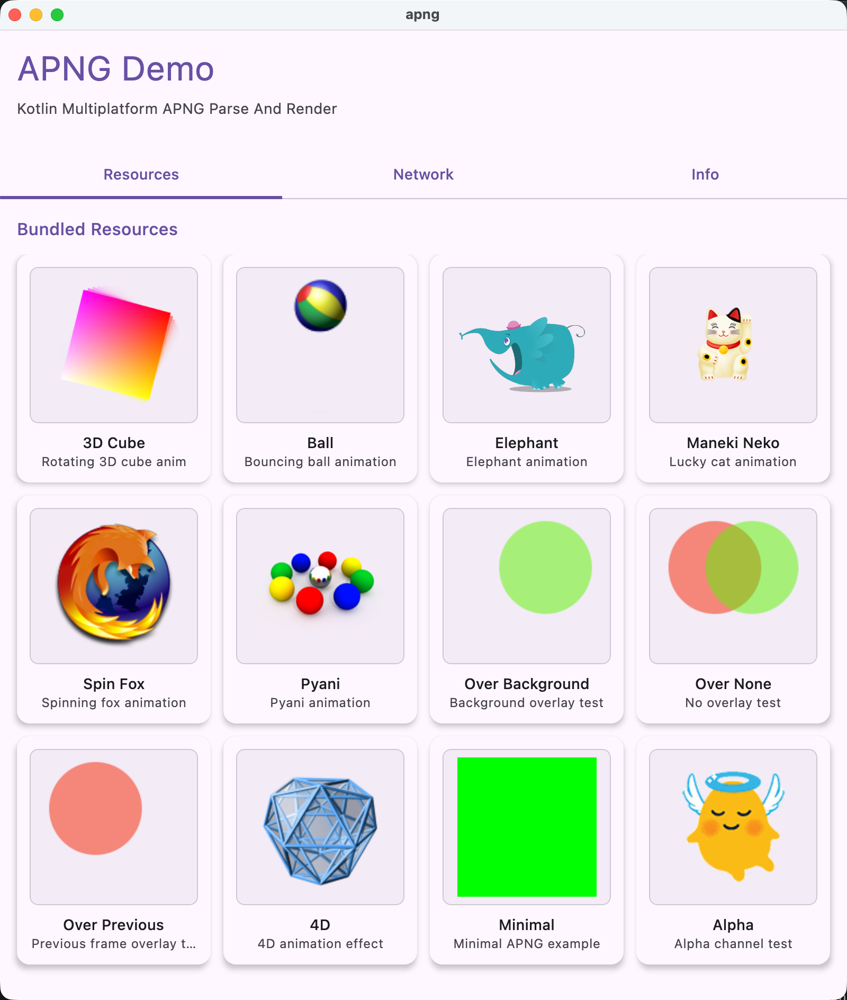

# APNG Kotlin 多平台库

[English Version](./README.md)

[](https://kotlinlang.org)
[](https://www.jetbrains.com/lp/compose-multiplatform/)
[](https://android-arsenal.com/api?level=21)
[](LICENSE)
[](https://central.sonatype.com/search?q=io.github.lugf027)

一个高性能、模块化的 Kotlin 多平台 APNG（动画 PNG）解析和渲染库，支持网络加载、缓存和跨平台资源管理。

## 功能特性

- ✅ **APNG 解析与渲染**：完全支持 APNG 动画格式
- ✅ **多平台支持**：Android、iOS、Desktop（JVM）和 Web（WASM/JS）
- ✅ **网络加载**：从 URL 下载并缓存 APNG 文件
- ✅ **LRU 缓存**：具有大小限制的自动磁盘缓存
- ✅ **进度回调**：实时追踪下载进度
- ✅ **自动重试**：指数退避的自动重试机制
- ✅ **Compose 集成**：原生 Jetpack Compose 多平台支持
- ✅ **多数据源**：支持从字节数组、文件、URL 或资源加载
- ✅ **错误处理**：全面的错误处理和备选方案



## 架构

该库组织为模块化组件：

```
apng-core/              # 核心 APNG 解析和渲染（无 UI）
│
├─ apng-network-core/   # 网络加载基础设施
│  ├─ ApngSource        # 数据源抽象
│  ├─ ApngResourceLoader# 平台特定的资源加载
│  ├─ ApngCacheStrategy # 缓存接口
│  ├─ DiskLruCache      # LRU 缓存实现
│  └─ HttpClient        # HTTP 客户端接口
│
├─ apng-network/        # 网络加载实现
│  ├─ KtorHttpClient    # 基于 Ktor 的 HTTP 客户端
│  └─ Composables       # 网络加载 Composables
│
├─ apng-resources/      # Compose Resources 支持
│  └─ Composables       # 资源加载 Composables
│
└─ apng-compose/        # Compose UI 组件
   ├─ ApngImage         # 主要 composable
   ├─ ApngPainter       # Painter 实现
   └─ ApngCompositionSpec # 多源加载
```

## 快速开始

### 安装

在你的 `build.gradle.kts` 中添加：

```kotlin
dependencies {
    // 核心库
    implementation("io.github.lugf027:apng-core:1.0.0")
    
    // UI 组件
    implementation("io.github.lugf027:apng-compose:1.0.0")
    
    // 网络加载（可选）
    implementation("io.github.lugf027:apng-network:1.0.0")
    
    // 资源加载（可选）
    implementation("io.github.lugf027:apng-resources:1.0.0")
}
```

### 基础用法 - 从字节数组加载

```kotlin
import androidx.compose.foundation.layout.*
import androidx.compose.material3.CircularProgressIndicator
import androidx.compose.runtime.Composable
import androidx.compose.ui.Modifier
import io.github.lugf027.apng.compose.ApngImage
import io.github.lugf027.apng.compose.ApngCompositionSpec
import io.github.lugf027.apng.compose.rememberApngCompositionSpec
import io.github.lugf027.apng.compose.ApngCompositionLoadResult

@Composable
fun DisplayApng(apngBytes: ByteArray) {
    val result = rememberApngCompositionSpec(
        spec = ApngCompositionSpec.Bytes(apngBytes)
    )
    
    when (result) {
        is ApngCompositionLoadResult.Loading -> {
            CircularProgressIndicator()
        }
        is ApngCompositionLoadResult.Success -> {
            ApngImage(
                composition = result.composition,
                contentDescription = "My APNG",
                modifier = Modifier.size(200.dp)
            )
        }
        is ApngCompositionLoadResult.Error -> {
            Text("Error: ${result.exception.message}")
        }
    }
}
```

### 从 URL 加载（需要网络支持）

```kotlin
import io.github.lugf027.apng.network.rememberApngCompositionFromUrl

@Composable
fun DisplayApngFromUrl() {
    val result = rememberApngCompositionFromUrl(
        url = "https://example.com/animation.apng"
    )
    
    when (result) {
        is ApngCompositionResult.Loading -> {
            // 显示进度
            val progress = result.progress ?: 0f
            LinearProgressIndicator(progress)
        }
        is ApngCompositionResult.Success -> {
            ApngImage(result.composition, "Loaded from URL")
        }
        is ApngCompositionResult.Error -> {
            Text("Download failed: ${result.exception.message}")
        }
    }
}
```

### 从本地文件加载

```kotlin
import io.github.lugf027.apng.compose.ApngCompositionSpec

@Composable
fun DisplayApngFromFile(filePath: String) {
    val result = rememberApngCompositionSpec(
        spec = ApngCompositionSpec.File(filePath)
    )
    // 处理结果...
}
```

### 从 Compose Resources 加载

```kotlin
import io.github.lugf027.apng.compose.ApngCompositionSpec

@Composable
fun DisplayApngFromResources() {
    val result = rememberApngCompositionSpec(
        spec = ApngCompositionSpec.Resource("drawable/animation.apng")
    )
    // 处理结果...
}
```

## 数据源

```kotlin
// 字节数组
ApngCompositionSpec.Bytes(data)

// 本地文件
ApngCompositionSpec.File(path)

// 网络 URL
ApngCompositionSpec.Url(url)

// Compose Resources
ApngCompositionSpec.Resource(resourcePath)
```

## 网络加载

### 网络配置

在应用启动时初始化：

```kotlin
import io.github.lugf027.apng.network.initializeApngNetwork
import android.app.Application

class MyApplication : Application() {
    override fun onCreate() {
        super.onCreate()
        // 初始化网络模块
        initializeApngNetwork()
    }
}
```

### 自定义配置

```kotlin
import io.github.lugf027.apng.network.KtorHttpClient
import io.github.lugf027.apng.network.DiskApngCacheStrategy
import io.github.lugf027.apng.network.DefaultHttpClient
import io.github.lugf027.apng.network.DefaultCacheStrategy

fun setupNetwork() {
    // 配置 HTTP 客户端
    DefaultHttpClient = KtorHttpClient(
        maxRetries = 5,              // 最大重试次数
        connectTimeoutMs = 30000,    // 连接超时
        requestTimeoutMs = 60000     // 请求超时
    )
    
    // 使用默认缓存（可自定义）
    // DefaultCacheStrategy = DiskApngCacheStrategy.Instance
}
```

### 进度追踪

```kotlin
@Composable
fun LoadWithProgress() {
    val result = rememberApngCompositionFromUrl(
        url = "https://example.com/animation.apng"
    )
    
    when (result) {
        is ApngCompositionResult.Loading -> {
            val progress = result.progress ?: 0f
            LinearProgressIndicator(progress)
        }
        is ApngCompositionResult.Success -> ApngImage(result.composition, null)
        is ApngCompositionResult.Error -> Text("Error")
    }
}
```

## 缓存

该库使用 LRU（最近最少使用）策略自动缓存下载的 APNG 文件：

```kotlin
import io.github.lugf027.apng.network.DiskApngCacheStrategy
import androidx.lifecycle.lifecycleScope
import kotlinx.coroutines.launch

val cache = DiskApngCacheStrategy.Instance

// 检查 URL 是否已缓存
val cachedPath = cache.path("https://example.com/animation.apng")
if (cachedPath != null) {
    println("Found in cache: $cachedPath")
}

// 清空所有缓存
lifecycleScope.launch {
    cache.clear()
    println("Cache cleared")
}
```

**默认缓存位置：**
- Android：`context.cacheDir/apng-cache`
- iOS：应用文档目录
- Desktop：系统临时目录
- Web：浏览器 IndexedDB（不持久化）

**默认缓存大小：** 100 MB

## 错误处理

```kotlin
@Composable
fun HandleErrors() {
    val result = rememberApngCompositionFromUrl(
        url = "https://example.com/animation.apng"
    )
    
    when (result) {
        is ApngCompositionResult.Error -> {
            when (result.exception) {
                is HttpException -> {
                    val statusCode = (result.exception as HttpException).statusCode
                    Text("HTTP Error: $statusCode")
                }
                is java.io.IOException -> {
                    Text("Network error. Check your connection.")
                }
                else -> {
                    Text("Error: ${result.exception.message}")
                }
            }
        }
        else -> {}
    }
}
```

## 命令式 API（协程）

```kotlin
import io.github.lugf027.apng.core.ApngLoader

lifecycleScope.launch {
    try {
        // 直接从 URL 加载
        val apngImage = ApngLoader().loadFromUrl(
            url = "https://example.com/animation.apng",
            onProgress = { downloaded, total ->
                println("Progress: $downloaded / $total bytes")
            }
        )
        
        // 使用加载的图像
        displayImage(apngImage)
    } catch (e: Exception) {
        showError(e.message)
    }
}
```

## 平台支持

| 功能 | Android | iOS | Desktop | Web |
|------|---------|-----|---------|-----|
| APNG 解析 | ✅ | ✅ | ✅ | ✅ |
| 文件加载 | ✅ | ✅ | ✅ | ❌ |
| 网络加载 | ✅ | ✅ | ✅ | ✅ |
| 资源加载 | ✅ | ✅ | ✅ | ❌ |
| 缓存 | ✅ | ✅ | ✅ | ⚠️ |
| HTTP 客户端 | Ktor/OkHttp | Ktor/Darwin | Ktor/OkHttp | Ktor/JS |

## 构建和运行

### Android

```shell
./gradlew :composeApp:assembleDebug
```

### Desktop

```shell
./gradlew :composeApp:run
```

### iOS

在 Xcode 中打开 `iosApp` 目录并从那里构建。

### Web（WASM）

```shell
./gradlew :composeApp:wasmJsBrowserDevelopmentRun
```

## 缓存策略接口

```kotlin
interface ApngCacheStrategy {
    fun path(url: String): Path?
    suspend fun save(url: String, bytes: ByteArray): Path?
    suspend fun load(url: String): ByteArray?
    suspend fun clear()
}
```

实现此接口来创建自定义缓存策略：

```kotlin
class NoCacheStrategy : ApngCacheStrategy {
    override fun path(url: String) = null
    override suspend fun save(url: String, bytes: ByteArray) = null
    override suspend fun load(url: String): ByteArray? = null
    override suspend fun clear() {}
}
```

## 加载结果类型

```kotlin
sealed interface ApngCompositionResult {
    data class Loading(val progress: Float?) : ApngCompositionResult
    data class Success(val composition: ApngImage) : ApngCompositionResult
    data class Error(val exception: Exception) : ApngCompositionResult
}
```

## 性能建议

1. **使用缓存**：下载的 APNG 文件会自动缓存。多次访问同一 URL 不会触发冗余下载。

2. **进度反馈**：使用进度回调来改进用户体验：
   ```kotlin
   rememberApngCompositionFromUrl(
       url = url,
       onProgress = { downloaded, total ->
           updateProgressBar(downloaded.toFloat() / total)
       }
   )
   ```

3. **错误处理**：提供清晰的错误消息而不是静默失败。

4. **自定义超时**：根据网络条件调整超时：
   ```kotlin
   DefaultHttpClient = KtorHttpClient(
       connectTimeoutMs = 60000,  // 为缓慢网络增加超时
       requestTimeoutMs = 120000
   )
   ```

## 常见问题

**Q: 网络加载有文件大小限制吗？**

A: 默认缓存大小为 100MB。超过此大小的文件不会被缓存。

**Q: 该库支持代理吗？**

A: 支持。你可以配置自定义 `HttpClient` 实现来支持代理。

**Q: Web 平台可以加载本地文件吗？**

A: 不可以。由于浏览器安全限制，Web 平台仅支持 URL 加载和字节数组。

**Q: 如何禁用缓存？**

A: 实现 `ApngCacheStrategy` 接口，对所有缓存操作返回 `null`。

## 迁移指南（从旧版本）

### 旧 API

```kotlin
val state = rememberApngStateFromPath(path)
when (state) {
    is ApngLoadState.Success -> ApngImage(state.apngImage, ...)
}
```

### 新 API

```kotlin
val result = rememberApngCompositionSpec(
    ApngCompositionSpec.File(path)
)
when (result) {
    is ApngCompositionLoadResult.Success -> ApngImage(result.composition, ...)
}
```

## 架构亮点

### 模块化设计

- 通过专用模块分离关注点
- 核心库没有 UI 依赖
- 网络加载是可选的且可插拔的

### 统一资源加载

- 所有数据源的抽象 `ApngSource`
- 通过 `expect/actual` 的平台特定实现
- 跨平台的一致错误处理

### 网络基础设施

- 基于 Ktor 的 HTTP 客户端，具有自动重试
- 可配置大小的 LRU 磁盘缓存
- 用于 UI 更新的进度回调
- 可扩展的缓存和 HTTP 客户端接口

### 跨平台一致性

- 所有平台上相同的 API
- 必要时的平台特定优化
- 不支持功能的优雅降级

## 许可证

MIT License - 详见 LICENSE 文件

## 贡献

欢迎贡献！在提交 PR 之前，请阅读我们的[贡献指南](docs/CONTRIBUTING.md)。

## 致谢

该库的优化遵循了 [Compottie](https://github.com/alexzhirkevich/compottie) 项目的架构模式和最佳实践。

---

了解更多关于：
- [Kotlin Multiplatform](https://www.jetbrains.com/help/kotlin-multiplatform-dev/get-started.html)
- [Compose Multiplatform](https://github.com/JetBrains/compose-multiplatform/)
- [Kotlin/Wasm](https://kotl.in/wasm/)
